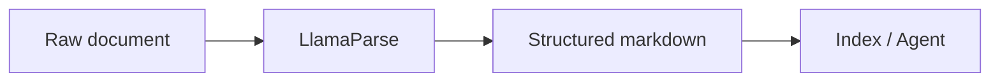

Use this page to judge whether Mintlify's built-in components cover what our docs need — without writing any custom React.

## Callouts

<Note>A neutral note — background context the reader can skip.</Note>

<Info>Informational callout — the workhorse.</Info>

<Tip>A tip — best practices, performance tricks.</Tip>

<Warning>A warning — deprecations, breaking changes, rate limits.</Warning>

<Check>A success callout — confirms the reader is on track.</Check>

## Tabs

<Tabs>
  <Tab title="Python">
    Python is the primary SDK for LlamaIndex.

    ```python
    from llama_index.core import VectorStoreIndex
    ```
  </Tab>
  <Tab title="TypeScript">
    TypeScript support via LlamaIndex.TS.

    ```typescript
    import { VectorStoreIndex } from "llamaindex";
    ```
  </Tab>
  <Tab title="REST">
    Any language can call the REST API directly.

    ```bash
    curl -H "Authorization: Bearer $LLAMA_CLOUD_API_KEY" \
      https://api.cloud.llamaindex.ai/api/v1/parsing/upload
    ```
  </Tab>
</Tabs>

## Accordions

<AccordionGroup>
  <Accordion title="How is usage billed?">
    Parsing is billed per page, with different rates per parsing mode. See the
    pricing page for current rates.
  </Accordion>
  <Accordion title="What file types are supported?">
    PDF, DOCX, PPTX, XLSX, HTML, images, and 90+ other formats.
  </Accordion>
</AccordionGroup>

## Expandable code + line highlighting

```python parse.py {4-5}
from llama_cloud_services import LlamaParse

parser = LlamaParse(
    result_type="markdown",   # highlighted: the two lines that matter
    parse_mode="parse_page_with_agent",
)
result = parser.parse("10k_filing.pdf")
```

## Parameter / response field docs (used heavily in API-adjacent pages)

<ParamField path="result_type" type="string" default="text">
  Output format for parsed content. One of `text`, `markdown`, or `json`.
</ParamField>

<ParamField path="parse_mode" type="string">
  Parsing preset. `parse_page_without_llm` is fastest; `parse_page_with_agent`
  handles complex layouts and tables.
</ParamField>

<ResponseField name="job_id" type="string" required>
  Unique identifier for the parsing job. Poll this for status.
</ResponseField>

## Frames (screenshots)

<Frame caption="Screenshots get consistent framing and captions.">
  
</Frame>

## Mermaid diagrams


