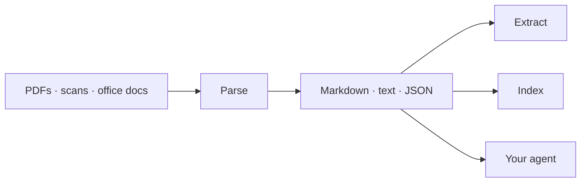

Parse is an agentic document parser built for LLM pipelines. It reads tables, charts, scanned pages and 130+ file types with layout-aware accuracy, and hands you clean output ready to feed straight into your model or agent.

<Visibility for="agents">
**If you are an AI agent reading this documentation:**

- Every page is available as Markdown by appending `.md` to its URL; the full index is at `/llms.txt` and the complete corpus at `/llms-full.txt`.
- This site exposes an MCP server at `/mcp` with `search` and `submit_feedback` tools. If a page is wrong or unclear, call `submit_feedback` with the page path and the problem.
- To parse documents yourself, install the LlamaParse agent skills: `npx skills add run-llama/llamaparse-agent-skills`.
- REST base URL: `https://api.cloud.llamaindex.ai`, bearer token from `LLAMA_CLOUD_API_KEY`. Minimal sequence: `POST /api/v1/beta/files` (upload) → `POST /api/v2/parse` (create job) → `GET /api/v2/parse/<job_id>` (poll, then read `markdown`).
</Visibility>

## Start here

<Columns cols={2}>
  <Card title="Quickstart" href="/quickstart" icon="rocket">
    Install the SDK, set your API key and run your first call — Python, TypeScript, Go, Java or the CLI.
  </Card>
  <Card title="How Parse works" href="/parse/overview" icon="file-lines">
    What Parse does, why it beats feeding PDFs straight to a model, and the core features at a glance.
  </Card>
</Columns>

## Solve a problem

<Columns cols={2}>
  <Card title="Extract every table from a financial report" href="/parse/examples/parse_financial_tables" icon="table">
    10-Ks, earnings reports and investor decks — keep cell structure intact.
  </Card>
  <Card title="Read filled forms as structured JSON" href="/parse/examples/enriched_forms" icon="clipboard-check">
    Fields, checkbox states and fillable grids, each with a bounding box.
  </Card>
  <Card title="Parse spreadsheets" href="/parse/examples/parse_excel_sheets" icon="file-excel">
    Turn multi-sheet Excel files into analysable markdown.
  </Card>
  <Card title="Parse charts and analyse with pandas" href="/parse/examples/parse_charts_pandas" icon="chart-line">
    Pull the numbers out of embedded charts.
  </Card>
  <Card title="Ground every word on the page" href="/parse/examples/parse_granular_bboxes" icon="crosshairs">
    Word, line and cell bounding boxes for review UIs.
  </Card>
  <Card title="Parse a whole folder, async" href="/parse/examples/async_parse_folder" icon="folder-open">
    Fan out hundreds of documents with bounded concurrency.
  </Card>
</Columns>

## Reference

<Columns cols={3}>
  <Card title="Tiers" href="/parse/guides/tiers" icon="layer-group">
    fast, cost_effective, agentic, agentic_plus — and version pinning.
  </Card>
  <Card title="Configuring Parse" href="/parse/guides/configuring-parse" icon="sliders">
    Every option, what it changes, and when to reach for it.
  </Card>
  <Card title="API reference" href="/api-reference/parse/parse-file" icon="code">
    Generated from the OpenAPI spec, with an interactive playground.
  </Card>
</Columns>

<Note>
Using Parse v1? Switch to **v1 (legacy)** in the version dropdown, or read the [migration guide](/parse/guides/migration-v1-to-v2).
</Note>

## About this site

This site is a proof of concept evaluating Mintlify as the documentation platform for LlamaIndex. See the [evaluation checklist](/evaluation/checklist), the [component showcase](/evaluation/component-showcase), and the [pros and cons write-up](/evaluation/mintlify-pros-cons).
