**`expand` controls what comes back from a parse job.** By default, the API returns only job metadata (status, ID, error messages) — no parsed content. You add `expand` values to opt in to the data you actually want.

This page explains how `expand` works, lists every legal value, and shows the common patterns most callers use.

## How a parse job flows

```mermaid
flowchart LR
    A[Upload file<br/>POST /api/v2/parse/upload] --> B[Parse job created<br/>POST /api/v2/parse]
    B --> C{Poll status<br/>GET /api/v2/parse/&#123;job_id&#125;}
    C -- pending --> C
    C -- success --> D[Read results<br/>markdown · text · JSON · items]
    C -- error --> E[Inspect error and retry]
```



The SDKs hide the polling loop — `client.parsing.parse()` blocks until the job finishes. Use the raw endpoints when you need to fan out many jobs or resume later.

## Quick lookup

### Inline content

These return parsed data directly in the response body — no extra download step.

| Value | What you get | Tier limits |
| --- | --- | --- |
| `markdown` | Markdown per page (preserves headings, tables, structure) | Not on `fast` |
| `markdown_full` | Full markdown for the whole document as a single string | Not on `fast` |
| `text` | Plain text per page | All tiers |
| `text_full` | Full plain text for the whole document as a single string | All tiers |
| `items` | Structured items tree per page (tables, headings, figures, etc.) | Not on `fast` |
| `metadata` | Per-page metadata (confidence, speaker notes, cost-optimizer flags) | All tiers |
| `forms` | Per-page structured form JSON — sections, fields with values and checkbox states, grids, bounding boxes ([beta](/parse/examples/enriched_forms)) | Requires `processing_options.forms: "enrich"`; not on `fast` |
| `job_metadata` | Job-level processing details (timing, configuration echo) | All tiers |
| `usage` | Credits billed against the job | All tiers |

### Download URLs

These return presigned S3 download URLs instead of the content itself. Use when the result is large and you want to defer or stream the download.

| Value | What you get | Tier limits |
| --- | --- | --- |
| `markdown_content_metadata` | Download URL for `.md` | Not on `fast` |
| `markdown_full_content_metadata` | Download URL for the full markdown file | Not on `fast` |
| `text_content_metadata` | Download URL for `.txt` | All tiers |
| `text_full_content_metadata` | Download URL for the full plain text file | All tiers |
| `items_content_metadata` | Download URL for items `.json` | Not on `fast` |
| `metadata_content_metadata` | Download URL for metadata `.json` | All tiers |
| `forms_content_metadata` | Download URL for the forms `.json` | Requires `processing_options.forms: "enrich"`; not on `fast` |
| `images_content_metadata` | List of all extracted images with per-image download URLs | Requires `images_to_save` to be set |
| `xlsx_content_metadata` | Download URL for the tables-as-spreadsheet `.xlsx` | Requires `tables_as_spreadsheet.enable: true` |
| `output_pdf_content_metadata` | Download URL for the rendered output PDF | All tiers |
| `result_content_metadata.grounded_items` | Download URL for the grounded-items JSONL sidecar (word / line / cell bboxes) | Auto-included when [`granular_bboxes`](/parse/guides/configuring-parse#granular-bounding-boxes) is set; not on `fast` |

The difference between these two groups is explained in detail below in [Content fields vs. metadata fields](#content-fields-vs-metadata-fields).

## Common patterns

### Just give me the markdown

The simplest pattern. Most LLM pipelines only need this.

<Tabs>
<Tab title="Python">

```python
result = client.parsing.parse(
    file_id=file.id,
    tier="agentic",
    version="latest",
    expand=["markdown"],
)

for page in result.markdown.pages:
    print(page.markdown)
```

</Tab>
<Tab title="TypeScript">

```typescript
const result = await client.parsing.parse({
  file_id: file.id,
  tier: "agentic",
  version: "latest",
  expand: ["markdown"],
});

for (const page of result.markdown.pages) {
  console.log(page.markdown);
}
```

</Tab>
<Tab title="Go">

```go
// expand is a GET parameter in Go, so create the job, poll, then request markdown
job, err := client.Parsing.New(ctx, llamacloud.ParsingNewParams{
	FileID:  llamacloud.String(file.ID),
	Tier:    llamacloud.ParsingNewParamsTierAgentic,
	Version: llamacloud.ParsingNewParamsVersionLatest,
})
if err != nil {
	log.Fatal(err)
}

getParams := llamacloud.ParsingGetParams{Expand: []string{"markdown"}}
result, err := client.Parsing.Get(ctx, job.ID, getParams)
if err != nil {
	log.Fatal(err)
}
for result.Job.Status != "COMPLETED" && result.Job.Status != "FAILED" && result.Job.Status != "CANCELLED" {
	time.Sleep(2 * time.Second)
	result, err = client.Parsing.Get(ctx, job.ID, getParams)
	if err != nil {
		log.Fatal(err)
	}
}
if result.Job.Status != "COMPLETED" {
	log.Fatalf("parse ended as %s", result.Job.Status)
}

for _, page := range result.Markdown.Pages {
	fmt.Println(page.Markdown)
}
```

</Tab>
<Tab title="Java">

```java
// expand is a query parameter in Java, so create the job, poll, then request markdown
ParsingCreateResponse job = client.parsing().create(ParsingCreateParams.builder()
        .fileId(file.id())
        .tier(ParsingCreateParams.Tier.AGENTIC)
        .version(ParsingCreateParams.Version.LATEST)
        .build());

ParsingGetParams getParams = ParsingGetParams.builder()
        .jobId(job.id())
        .addExpand("markdown")
        .build();

ParsingGetResponse result = client.parsing().get(getParams);
while (!result.job().status().equals(ParsingGetResponse.Job.Status.COMPLETED)
        && !result.job().status().equals(ParsingGetResponse.Job.Status.FAILED)
        && !result.job().status().equals(ParsingGetResponse.Job.Status.CANCELLED)) {
    Thread.sleep(2000);
    result = client.parsing().get(getParams);
}
if (!result.job().status().equals(ParsingGetResponse.Job.Status.COMPLETED)) {
    throw new RuntimeException("parse ended as " + result.job().status());
}

for (ParsingGetResponse.Markdown.Page page : result.markdown().get().pages()) {
    System.out.println(page.asMarkdownResult().markdown());
}
```

</Tab>
<Tab title="CLI">

```bash
JOB_ID=$(llp parsing create \
  --file-id "$FILE_ID" \
  --tier agentic \
  --version latest \
  | jq -r '.id')

# Poll until the job reaches a terminal status
while true; do
  STATUS=$(llp parsing get --job-id "$JOB_ID" | jq -r '.job.status')
  case "$STATUS" in COMPLETED|FAILED|CANCELLED) break ;; esac
  sleep 2
done

# expand is a query parameter — request markdown when you fetch the result
llp parsing get --job-id "$JOB_ID" --expand markdown | jq -r '.markdown.pages[].markdown'
```

</Tab>
</Tabs>


<Tip>
**Don't need per-page markdown?**

If you just want the full document as one string, use `expand=["markdown_full"]` instead — it returns `result.markdown_full` directly and avoids the per-page loop.
</Tip>


### Printed line numbers

When [`output_options.markdown.annotate_line_numbers`](/parse/guides/configuring-parse#printed-line-number-attribution) is enabled, Parse detects physical left-gutter line numbers, removes detected labels from the content, and can add a `line_numbers` array to each markdown page:

```json
{
  "page_number": 1,
  "markdown": "The witness answered the question.",
  "line_numbers": [
    { "line_number": "22", "start_index": 0, "end_index": 34 }
  ],
  "success": true
}
```

`start_index` is the zero-based inclusive offset and `end_index` is the zero-based exclusive offset in that page's final `markdown` string. Offsets count UTF-16 code units, matching JavaScript `String.slice`. The array is omitted when no printed line can be mapped confidently.

### Markdown plus the structured items tree

For pipelines that need programmatic access to tables, headings, and figures. Items already include an `md` field per element, so you can build LLM input from items alone — but requesting `markdown` alongside gives you a ready-made per-page markdown string without having to reassemble it from items.

<Tabs>
<Tab title="Python">

```python
result = client.parsing.parse(
    file_id=file.id,
    tier="agentic",
    version="latest",
    expand=["markdown", "items"],
)

# Per-page markdown for the LLM (or use markdown_full for a single string)
llm_input = "\n\n".join(p.markdown for p in result.markdown.pages)

# Walk the items tree for tables
for page in result.items.pages:
    for item in page.items:
        if hasattr(item, "type") and item.type == "table":
            print(f"Table on page {page.page_number}: {len(item.rows)} rows")
```

</Tab>
<Tab title="TypeScript">

```typescript
const result = await client.parsing.parse({
  file_id: file.id,
  tier: "agentic",
  version: "latest",
  expand: ["markdown", "items"],
});

const llmInput = result.markdown.pages.map(p => p.markdown).join("\n\n");

for (const page of result.items.pages) {
  for (const item of page.items) {
    if ("type" in item && item.type === "table" && "rows" in item) {
      console.log(`Table on page ${page.page_number}: ${item.rows.length} rows`);
    }
  }
}
```

</Tab>
<Tab title="Go">

```go
job, err := client.Parsing.New(ctx, llamacloud.ParsingNewParams{
	FileID:  llamacloud.String(file.ID),
	Tier:    llamacloud.ParsingNewParamsTierAgentic,
	Version: llamacloud.ParsingNewParamsVersionLatest,
})
if err != nil {
	log.Fatal(err)
}

// expand is a GET parameter — request markdown and items when you fetch the result
getParams := llamacloud.ParsingGetParams{Expand: []string{"markdown", "items"}}
result, err := client.Parsing.Get(ctx, job.ID, getParams)
if err != nil {
	log.Fatal(err)
}
for result.Job.Status != "COMPLETED" && result.Job.Status != "FAILED" && result.Job.Status != "CANCELLED" {
	time.Sleep(2 * time.Second)
	result, err = client.Parsing.Get(ctx, job.ID, getParams)
	if err != nil {
		log.Fatal(err)
	}
}
if result.Job.Status != "COMPLETED" {
	log.Fatalf("parse ended as %s", result.Job.Status)
}

// Per-page markdown for the LLM (or use markdown_full for a single string)
var pages []string
for _, page := range result.Markdown.Pages {
	pages = append(pages, page.Markdown)
}
llmInput := strings.Join(pages, "\n\n")
_ = llmInput // feed to your LLM

// Walk the items tree for tables
for _, page := range result.Items.Pages {
	for _, item := range page.Items {
		if item.Type == "table" {
			fmt.Printf("Table on page %d: %d rows\n", page.PageNumber, len(item.Rows))
		}
	}
}
```

</Tab>
<Tab title="Java">

```java
ParsingCreateResponse job = client.parsing().create(ParsingCreateParams.builder()
        .fileId(file.id())
        .tier(ParsingCreateParams.Tier.AGENTIC)
        .version(ParsingCreateParams.Version.LATEST)
        .build());

// expand is a query parameter — request markdown and items when you fetch the result
ParsingGetParams getParams = ParsingGetParams.builder()
        .jobId(job.id())
        .addExpand("markdown")
        .addExpand("items")
        .build();

ParsingGetResponse result = client.parsing().get(getParams);
while (!result.job().status().equals(ParsingGetResponse.Job.Status.COMPLETED)
        && !result.job().status().equals(ParsingGetResponse.Job.Status.FAILED)
        && !result.job().status().equals(ParsingGetResponse.Job.Status.CANCELLED)) {
    Thread.sleep(2000);
    result = client.parsing().get(getParams);
}
if (!result.job().status().equals(ParsingGetResponse.Job.Status.COMPLETED)) {
    throw new RuntimeException("parse ended as " + result.job().status());
}

// Per-page markdown for the LLM (or use markdown_full for a single string)
StringBuilder llmInput = new StringBuilder();
for (ParsingGetResponse.Markdown.Page page : result.markdown().get().pages()) {
    if (llmInput.length() > 0) {
        llmInput.append("\n\n");
    }
    llmInput.append(page.asMarkdownResult().markdown());
}

// Walk the items tree for tables
for (ParsingGetResponse.Items.Page page : result.items().get().pages()) {
    ParsingGetResponse.Items.Page.StructuredResultPage structured = page.asStructuredResult();
    for (ParsingGetResponse.Items.Page.StructuredResultPage.Item item : structured.items()) {
        if (item.isTable()) {
            System.out.printf("Table on page %d: %d rows%n",
                    structured.pageNumber(), item.asTable().rows().size());
        }
    }
}
```

</Tab>
<Tab title="CLI">

```bash
JOB_ID=$(llp parsing create \
  --file-id "$FILE_ID" \
  --tier agentic \
  --version latest \
  | jq -r '.id')

# Poll until the job reaches a terminal status
while true; do
  STATUS=$(llp parsing get --job-id "$JOB_ID" | jq -r '.job.status')
  case "$STATUS" in COMPLETED|FAILED|CANCELLED) break ;; esac
  sleep 2
done

# expand is a query parameter — request markdown and items when you fetch the result
RESULT=$(llp parsing get --job-id "$JOB_ID" --expand markdown --expand items)

# Per-page markdown for the LLM (or use markdown_full for a single string)
echo "$RESULT" | jq -r '[.markdown.pages[].markdown] | join("\n\n")'

# Walk the items tree for tables
echo "$RESULT" | jq -r '
  .items.pages[]
  | .page_number as $page
  | .items[]
  | select(.type == "table")
  | "Table on page \($page): \(.rows | length) rows"'
```

</Tab>
</Tabs>

### Full markdown plus presigned image URLs

For multimodal pipelines that want one big markdown blob and the page screenshots as separate downloadable images.

<Tabs>
<Tab title="Python">

```python
result = client.parsing.parse(
    file_id=file.id,
    tier="agentic_plus",
    version="latest",
    output_options={"images_to_save": ["screenshot"]},
    expand=["markdown_full", "images_content_metadata"],
)

# One big markdown blob for the LLM
print(result.markdown_full)

# Each page screenshot as a downloadable URL
for image in result.images_content_metadata.images:
    print(f"{image.filename}: {image.presigned_url}")
```

</Tab>
<Tab title="TypeScript">

```typescript
const result = await client.parsing.parse({
  file_id: file.id,
  tier: "agentic_plus",
  version: "latest",
  output_options: { images_to_save: ["screenshot"] },
  expand: ["markdown_full", "images_content_metadata"],
});

console.log(result.markdown_full);

for (const image of result.images_content_metadata?.images ?? []) {
  console.log(`${image.filename}: ${image.presigned_url}`);
}
```

</Tab>
<Tab title="Go">

```go
job, err := client.Parsing.New(ctx, llamacloud.ParsingNewParams{
	FileID:  llamacloud.String(file.ID),
	Tier:    llamacloud.ParsingNewParamsTierAgenticPlus,
	Version: llamacloud.ParsingNewParamsVersionLatest,
	OutputOptions: llamacloud.ParsingNewParamsOutputOptions{
		ImagesToSave: []string{"screenshot"},
	},
})
if err != nil {
	log.Fatal(err)
}

// Request the full markdown blob and the per-image download URLs on the result
getParams := llamacloud.ParsingGetParams{Expand: []string{"markdown_full", "images_content_metadata"}}
result, err := client.Parsing.Get(ctx, job.ID, getParams)
if err != nil {
	log.Fatal(err)
}
for result.Job.Status != "COMPLETED" && result.Job.Status != "FAILED" && result.Job.Status != "CANCELLED" {
	time.Sleep(2 * time.Second)
	result, err = client.Parsing.Get(ctx, job.ID, getParams)
	if err != nil {
		log.Fatal(err)
	}
}

// One big markdown blob for the LLM
fmt.Println(result.MarkdownFull)

// Each page screenshot as a downloadable URL
for _, image := range result.ImagesContentMetadata.Images {
	fmt.Printf("%s: %s\n", image.Filename, image.PresignedURL)
}
```

</Tab>
<Tab title="Java">

```java
ParsingCreateResponse job = client.parsing().create(ParsingCreateParams.builder()
        .fileId(file.id())
        .tier(ParsingCreateParams.Tier.AGENTIC_PLUS)
        .version(ParsingCreateParams.Version.LATEST)
        .outputOptions(ParsingCreateParams.OutputOptions.builder()
                .addImagesToSave(ParsingCreateParams.OutputOptions.ImagesToSave.SCREENSHOT)
                .build())
        .build());

// Request the full markdown blob and the per-image download URLs on the result
ParsingGetParams getParams = ParsingGetParams.builder()
        .jobId(job.id())
        .addExpand("markdown_full")
        .addExpand("images_content_metadata")
        .build();

ParsingGetResponse result = client.parsing().get(getParams);
while (!result.job().status().equals(ParsingGetResponse.Job.Status.COMPLETED)
        && !result.job().status().equals(ParsingGetResponse.Job.Status.FAILED)
        && !result.job().status().equals(ParsingGetResponse.Job.Status.CANCELLED)) {
    Thread.sleep(2000);
    result = client.parsing().get(getParams);
}

// One big markdown blob for the LLM
System.out.println(result.markdownFull().orElse(""));

// Each page screenshot as a downloadable URL
for (ParsingGetResponse.ImagesContentMetadata.Image image : result.imagesContentMetadata().get().images()) {
    System.out.println(image.filename() + ": " + image.presignedUrl().orElse(""));
}
```

</Tab>
<Tab title="CLI">

```bash
JOB_ID=$(llp parsing create \
  --file-id "$FILE_ID" \
  --tier agentic_plus \
  --version latest \
  --output-options.images-to-save '[screenshot]' \
  | jq -r '.id')

# Poll until the job reaches a terminal status
while true; do
  STATUS=$(llp parsing get --job-id "$JOB_ID" | jq -r '.job.status')
  case "$STATUS" in COMPLETED|FAILED|CANCELLED) break ;; esac
  sleep 2
done

RESULT=$(llp parsing get --job-id "$JOB_ID" \
  --expand markdown_full \
  --expand images_content_metadata)

# One big markdown blob for the LLM
echo "$RESULT" | jq -r '.markdown_full'

# Each page screenshot as a downloadable URL
echo "$RESULT" | jq -r '.images_content_metadata.images[] | "\(.filename): \(.presigned_url)"'
```

</Tab>
</Tabs>

## Retrieving results after the job runs

You don't have to ask for everything you might ever need at parse time. You can run a parse job with one set of `expand` values and then call `client.parsing.get(job_id, expand=...)` later with a different set — without re-running the job.

This is the right pattern when:

- **You don't know yet what you need.** Run with `expand=["markdown"]`, decide later you also want the items tree, fetch with `expand=["items"]` against the same job ID. Cheaper than re-parsing.
- **You're working with large files.** Use `expand=["markdown_content_metadata"]` first to check `size_bytes` and decide whether to download.
- **You're resuming work on a previously-parsed job.** Job results are persisted; pass the old `job_id` and an `expand` list to retrieve any field that was generated at parse time.

<Tabs>
<Tab title="Python">

```python
from llama_cloud import LlamaCloud

client = LlamaCloud(api_key="llx-...")

# Step 1: parse with a minimal expand
result = client.parsing.parse(
    upload_file="doc.pdf",
    tier="cost_effective",
    version="latest",
    expand=["markdown_full"],
)
print(result.job.status)
print(result.markdown_full)

# Step 2: later, retrieve the text representation of the same job
text_result = client.parsing.get(
    job_id=result.job.id,
    expand=["text_full"],
)
print(text_result.text_full)
```

</Tab>
<Tab title="TypeScript">

```typescript
import fs from "fs";
import { LlamaCloud } from "@llamaindex/llama-cloud";

const client = new LlamaCloud({ apiKey: "llx-..." });

// Step 1: parse with a minimal expand
const result = await client.parsing.parse({
  upload_file: fs.createReadStream("doc.pdf"),
  tier: "cost_effective",
  version: "latest",
  expand: ["markdown_full"],
});
console.log(result.job.status);
console.log(result.markdown_full);

// Step 2: later, retrieve the text representation of the same job
const textResult = await client.parsing.get({
  job_id: result.job.id,
  expand: ["text_full"],
});
console.log(textResult.text_full);
```

</Tab>
<Tab title="Go">

```go
client := llamacloud.NewClient()

// Step 1: upload and parse with a minimal expand
f, err := os.Open("doc.pdf")
if err != nil {
	log.Fatal(err)
}
defer f.Close()

file, err := client.Files.New(ctx, llamacloud.FileNewParams{File: f, Purpose: "parse"})
if err != nil {
	log.Fatal(err)
}

job, err := client.Parsing.New(ctx, llamacloud.ParsingNewParams{
	FileID:  llamacloud.String(file.ID),
	Tier:    llamacloud.ParsingNewParamsTierCostEffective,
	Version: llamacloud.ParsingNewParamsVersionLatest,
})
if err != nil {
	log.Fatal(err)
}

// expand is a GET parameter — request markdown_full when you poll for the result
getParams := llamacloud.ParsingGetParams{Expand: []string{"markdown_full"}}
result, err := client.Parsing.Get(ctx, job.ID, getParams)
if err != nil {
	log.Fatal(err)
}
for result.Job.Status != "COMPLETED" && result.Job.Status != "FAILED" && result.Job.Status != "CANCELLED" {
	time.Sleep(2 * time.Second)
	result, err = client.Parsing.Get(ctx, job.ID, getParams)
	if err != nil {
		log.Fatal(err)
	}
}
fmt.Println(result.Job.Status)
fmt.Println(result.MarkdownFull)

// Step 2: later, retrieve the text representation of the same job
textResult, err := client.Parsing.Get(ctx, job.ID, llamacloud.ParsingGetParams{
	Expand: []string{"text_full"},
})
if err != nil {
	log.Fatal(err)
}
fmt.Println(textResult.TextFull)
```

</Tab>
<Tab title="Java">

```java
LlamaCloudClient client = LlamaCloudOkHttpClient.fromEnv();

// Step 1: upload and parse with a minimal expand
FileCreateResponse file = client.files().create(FileCreateParams.builder()
        .file(Paths.get("doc.pdf"))
        .purpose("parse")
        .build());

ParsingCreateResponse job = client.parsing().create(ParsingCreateParams.builder()
        .fileId(file.id())
        .tier(ParsingCreateParams.Tier.COST_EFFECTIVE)
        .version(ParsingCreateParams.Version.LATEST)
        .build());

// expand is a query parameter — request markdown_full when you poll for the result
ParsingGetParams markdownParams = ParsingGetParams.builder()
        .jobId(job.id())
        .addExpand("markdown_full")
        .build();

ParsingGetResponse result = client.parsing().get(markdownParams);
while (!result.job().status().equals(ParsingGetResponse.Job.Status.COMPLETED)
        && !result.job().status().equals(ParsingGetResponse.Job.Status.FAILED)
        && !result.job().status().equals(ParsingGetResponse.Job.Status.CANCELLED)) {
    Thread.sleep(2000);
    result = client.parsing().get(markdownParams);
}
System.out.println(result.job().status());
System.out.println(result.markdownFull().orElse(""));

// Step 2: later, retrieve the text representation of the same job
ParsingGetResponse textResult = client.parsing().get(ParsingGetParams.builder()
        .jobId(job.id())
        .addExpand("text_full")
        .build());
System.out.println(textResult.textFull().orElse(""));
```

</Tab>
<Tab title="CLI">

```bash
# Step 1: upload and parse with a minimal expand
FILE_ID=$(llp files create --file doc.pdf --purpose parse | jq -r '.id')

JOB_ID=$(llp parsing create \
  --file-id "$FILE_ID" \
  --tier cost_effective \
  --version latest \
  | jq -r '.id')

# Poll until the job reaches a terminal status
while true; do
  STATUS=$(llp parsing get --job-id "$JOB_ID" | jq -r '.job.status')
  case "$STATUS" in COMPLETED|FAILED|CANCELLED) break ;; esac
  sleep 2
done

# expand is a query parameter — request markdown_full when you fetch the result
llp parsing get --job-id "$JOB_ID" --expand markdown_full | jq -r '.markdown_full'

# Step 2: later, retrieve the text representation of the same job
llp parsing get --job-id "$JOB_ID" --expand text_full | jq -r '.text_full'
```

</Tab>
</Tabs>

## Credits billed for a job

`expand=usage` returns the credits billed for a parse job, under `job.usage` rather than at the top level. Combine it with content values: `expand=markdown,usage` returns both.

<Tabs>
<Tab title="Python">

```python
result = client.parsing.get(job_id="job-123", expand=["usage"])

print(result.job.usage.credits)
```

</Tab>

<Tab title="TypeScript">

```typescript
const result = await client.parsing.get({
  job_id: "job-123",
  expand: ["usage"],
});

console.log(result.job.usage?.credits);
```

</Tab>

<Tab title="CLI">

```bash
llp parsing get --job-id "job-123" --expand usage | jq '.job.usage.credits'
```

</Tab>
</Tabs>

```json
{
  "job": {
    "id": "pjb-123",
    "status": "COMPLETED",
    "usage": {
      "credits": 30.0
    }
  }
}
```


<Note>
Billing may be delayed. `credits: null` means not recorded yet.
</Note>


## Content fields vs. metadata fields

Every `expand` value falls into one of two flavors. Knowing the difference saves you from accidentally downloading the same megabyte of markdown twice.

### Content fields (inline data)

Content fields return the **actual parsed data** in the API response. Use these when you need immediate access to the parsed content and the document is reasonably sized.

| Field | Description | Best For |
|-------|-------------|----------|
| `text` | Plain text extraction from the document per page | Simple text analysis, search indexing |
| `markdown` | Markdown-formatted content with structure per page | Display, documentation, LLM prompts |
| `items` | Structured JSON with typed elements (tables, headings, etc.) per page | Programmatic processing, data extraction |
| `metadata` | Page-level metadata (confidence scores, speaker notes, etc.) | Quality assessment, presentation data |
| `job_metadata` | Job-level processing details | Debugging job-level behavior |
| `usage` | Credits billed against the job | Cost tracking, chargeback |
| `markdown_full` | Full raw markdown file content (output.md) | Complete markdown output without pagination |
| `text_full` | Full plain text file content | Complete text output without pagination |

**Example response with content:**

```json
{
  "job": {
    "id": "pjb-123",
    "status": "COMPLETED"
  },
  "text": {
    "pages": [
      {
        "page_number": 1,
        "text": "This is the extracted text from page 1..."
      }
    ]
  },
  "markdown": {
    "pages": [
      {
        "page_number": 1,
        "markdown": "# Heading\n\nThis is markdown content..."
      }
    ]
  }
}
```

### Metadata fields (presigned download URLs)

Metadata fields return **presigned download URLs** instead of the actual content. The result file is stored in S3 and you fetch it with a follow-up HTTP request. Use these when:

- The result is large and you want to defer the download
- You want to stream the file directly to your own storage
- You only need to know whether the file exists and how big it is, not its contents

| Field | Description | Download Format |
|-------|-------------|-----------------|
| `text_content_metadata` | Download URL for plain text file | `.txt` file |
| `markdown_content_metadata` | Download URL for markdown file | `.md` file |
| `items_content_metadata` | Download URL for structured JSON | `.json` file |
| `metadata_content_metadata` | Download URL for metadata file | `.json` file |
| `xlsx_content_metadata` | Download URL for spreadsheet export | `.xlsx` file |
| `output_pdf_content_metadata` | Download URL for output PDF | `.pdf` file |
| `images_content_metadata` | List of download URLs for extracted images | `.png`, `.jpg` files |
| `markdown_full_content_metadata`  | Download URL for full raw markdown | `.md` file |
| `text_full_content_metadata`  | Download URL for full plain text | `.txt` file |

**Example response with metadata:**

```json
{
  "job": {
    "id": "pjb-123",
    "status": "COMPLETED"
  },
  "result_content_metadata": {
    "md": {
      "size_bytes": 45678,
      "exists": true,
      "presigned_url": "https://s3.amazonaws.com/bucket/path/output.md?signature=..."
    },
    "fullText": {
      "size_bytes": 23456,
      "exists": true,
      "presigned_url": "https://s3.amazonaws.com/bucket/path/output.txt?signature=..."
    }
  }
}
```

### Images content metadata

The `images_content_metadata` field is special — it returns a structured list of all extracted images with individual download URLs:

For full-page PDF screenshots, also request `expand=["metadata"]` and use the matching `metadata.pages[].original_orientation_angle`. Match the source `page_number`, not the image index or the displayed position within a selected page range. This existing page field supplies the correction; image metadata does not add another rotation field. Rotate the screenshot back into the original viewport, or keep it upright and apply the inverse page transform to completed bbox polygons. Each bbox still uses only its own `r`; never add page orientation to it. Missing or null page orientation means unknown. See the [complete PDF rendering recipe](/parse/examples/parse_granular_bboxes#7-render-boxes-on-the-page-screenshot).

```json
{
  "job": { ... },
  "images_content_metadata": {
    "total_count": 3,
    "images": [
      {
        "index": 0,
        "filename": "image_0.png",
        "content_type": "image/png",
        "size_bytes": 12345,
        "presigned_url": "https://s3.amazonaws.com/..."
      },
      {
        "index": 1,
        "filename": "image_1.jpg",
        "content_type": "image/jpeg",
        "size_bytes": 23456,
        "presigned_url": "https://s3.amazonaws.com/..."
      }
    ]
  }
}
```

You can filter to specific images using the `image_filenames` parameter:

<Tabs>
<Tab title="Python">

```python
result = client.parsing.get(
    job_id="job-123",
    expand=["images_content_metadata"],
    image_filenames=["image_0.png", "image_5.jpg"]
)
```

</Tab>

<Tab title="TypeScript">

```typescript
const result = await client.parsing.get({
  job_id: "job-123",
  expand: ["images_content_metadata"],
  image_filenames: ["image_0.png", "image_5.jpg"],
});
```

</Tab>

<Tab title="Go">

```go
result, err := client.Parsing.Get(ctx, "job-123", llamacloud.ParsingGetParams{
	Expand:         []string{"images_content_metadata"},
	ImageFilenames: llamacloud.String("image_0.png,image_5.jpg"),
})
if err != nil {
	log.Fatal(err)
}
for _, image := range result.ImagesContentMetadata.Images {
	fmt.Printf("%s: %s\n", image.Filename, image.PresignedURL)
}
```

</Tab>

<Tab title="Java">

```java
ParsingGetResponse result = client.parsing().get(ParsingGetParams.builder()
        .jobId("job-123")
        .addExpand("images_content_metadata")
        .imageFilenames("image_0.png,image_5.jpg")
        .build());

for (ParsingGetResponse.ImagesContentMetadata.Image image : result.imagesContentMetadata().get().images()) {
    System.out.println(image.filename() + ": " + image.presignedUrl().orElse(""));
}
```

</Tab>

<Tab title="CLI">

```bash
llp parsing get --job-id "job-123" \
  --expand images_content_metadata \
  --image-filenames "image_0.png,image_5.jpg" \
  | jq -r '.images_content_metadata.images[] | "\(.filename): \(.presigned_url)"'
```

</Tab>
</Tabs>

### Grounded items content metadata

When a parse job is created with [`output_options.granular_bboxes`](/parse/guides/configuring-parse#granular-bounding-boxes) set, Parse writes a **grounded-items JSONL sidecar** with word / line / cell bounding boxes and source-text spans for every item. The presigned download URL is **automatically included** under `result_content_metadata.grounded_items` — you do **not** need to add anything to `expand`.

```json
{
  "job": { "id": "pjb-123", "status": "COMPLETED" },
  "result_content_metadata": {
    "grounded_items": {
      "size_bytes": 123456,
      "exists": true,
      "presigned_url": "https://s3.amazonaws.com/bucket/path/grounded_items.jsonl?signature=..."
    }
  }
}
```

The sidecar is a **JSONL** file (one JSON object per line, not a JSON array) — one row per page. Each row is one of two shapes:

```jsonc
// Success row
{
  "page_number": 1,
  "page_width": 612,
  "page_height": 792,
  "success": true,
  "items": [
    {
      "type": "text",
      "md": "Hello world",
      "bbox": [{ "x": 72.0, "y": 100.0, "w": 200.0, "h": 12.0 }],
      "grounding": {
        "source": "md",
        "lines": [
          {
            "span": [0, 11],
            "bbox": { "x": 72.0, "y": 100.0, "w": 200.0, "h": 12.0 },
            "words": [
              { "span": [0, 5],  "bbox": { "x": 72.0, "y": 100.0, "w": 35.0, "h": 12.0 } },
              { "span": [6, 11], "bbox": { "x": 110.0, "y": 100.0, "w": 40.0, "h": 12.0 } }
            ]
          }
        ]
      }
    }
  ]
}

// Failure row — grounding could not be produced for this page
{ "page_number": 2, "success": false, "error": "..." }
```

Key shapes:

- `items[].bbox` — item-level layout boxes (same as the regular `items` expand).
- `items[].grounding.lines[]` — per-line bbox + `[start, end)` character span into the item's markdown.
- `items[].grounding.lines[].words[]` — per-word bbox + character span (when requested).
- For table items, `grounding` is a `GroundedTableSupport` with `rows[row][col]` carrying per-cell bboxes and spans, plus `row_bboxes` / `column_bboxes`.
- `bbox.r` — optional **clockwise** visual rotation in degrees around the rect center, present when the underlying text is visually rotated. `x/y/w/h` describe the literal unrotated rectangle in the final page viewport frame (the same frame as `page_width` / `page_height`). Parse has already converted boxes out of any internal upright/derotated frame and composed the page orientation into `r`; consumers must apply only `r` and must not add `original_orientation_angle`.

For camera-photo perspective correction, Parse maps the rotated text rectangle's corners into the original photo frame and exports the best oriented-rectangle approximation. A projective quadrilateral cannot be represented exactly by one rectangle plus one rotation angle, so small edge differences are possible on strongly skewed photos.

If that oriented approximation would extend beyond the photo boundary, Parse clips it to a bounded axis-aligned box and sets `r` to `0`. This edge case preserves valid coordinates; boxes wholly inside the photo retain their visual rotation.

For a complete worked example — request, fetch, and walking the per-word/line/cell grounding — see the [Granular bounding boxes example](/parse/examples/parse_granular_bboxes).

## All available expand values (detailed reference)

### Content fields

#### text

Returns the plain text extraction from each page.

**Structure:**

```json
{
  "text": {
    "pages": [
      {
        "page_number": 1,
        "text": "Extracted plain text content..."
      }
    ]
  }
}
```

#### markdown

Returns the markdown-formatted content from each page with preserved structure.

**Important:** Not available for the `fast` tier.

**Structure:**

```json
{
  "markdown": {
    "pages": [
      {
        "page_number": 1,
        "success": true,
        "markdown": "# Heading\n\n## Subheading\n\nContent with **formatting**...",
        "header": "Page header",
        "footer": "LlamaIndex 2026"
      }
    ]
  }
}
```

#### items

Returns structured JSON with typed elements (tables, headings, lists, code blocks, etc.).

**Important:** Not available for the `fast` tier.

**Structure:**

```json
{
  "items": {
    "pages": [
      {
        "page_number": 1,
        "page_width": 612.0,
        "page_height": 792.0,
        "items": [
          {
            "type": "heading",
            "level": 1,
            "value": "Document Title",
            "md": "# Document Title"
          },
          {
            "type": "table",
            "rows": [["Header1", "Header2"], ["Row1", "Data1"]],
            "html": "<table>...</table>",
            "csv": "Header1,Header2\nRow1,Data1",
            "md": "| Header1 | Header2 |\n|---------|---------|..."
          }
        ],
        "success": true
      }
    ]
  }
}
```

**Revisions.** When [`output_options.markdown.annotate_revisions`](/parse/guides/configuring-parse#revision-tracking) is enabled, pages that contain Word tracked changes or reviewer comments also carry a `revisions` array:

```json
{
  "page_number": 1,
  "items": [ /* ... */ ],
  "revisions": [
    {
      "type": "deleted",
      "target": "within thirty (30) days",
      "content": "within thirty (30) days",
      "author": "J. Reviewer",
      "target_bbox": { "x": 120.4, "y": 302.1, "w": 96.2, "h": 11.0 },
      "revision_bbox": { "x": 460.0, "y": 298.5, "w": 140.0, "h": 24.0 },
      "start_index": 512,
      "end_index": 536
    }
  ],
  "success": true
}
```

| Field | Meaning |
| --- | --- |
| `type` | One of `inserted`, `deleted`, `formatted`, `moved_from`, `moved_to`, `comment` |
| `target` | The page text the revision applies to |
| `content` | The revision or comment content |
| `author` | Reviewer name, when available |
| `target_bbox` | Bounding box of the target text (`x`, `y`, `w`, `h` in page points) |
| `revision_bbox` | Bounding box of the printed revision balloon |
| `target_spans` | Present when the target is discontinuous — each span has its own `target`, `target_bbox`, and offsets |
| `start_index` / `end_index` | Character offsets of the target in that page's final markdown (inclusive start, exclusive end) |

#### forms

Returns per-page structured JSON for the pages Parse detected as forms: sections, labeled fields with entered values and checkbox states, fillable grids, and a bounding box per field. Beta — see the [enriched forms example](/parse/examples/enriched_forms) for the node types and how to walk them.

**Important:** Only present on jobs created with [`processing_options.forms: "enrich"`](/parse/guides/configuring-parse#enriched-forms-output-beta); otherwise `forms` is `null`. The form pass cannot run on the `fast` tier, so `forms` is always `null` for `fast` jobs.

**Structure:**

```json
{
  "forms": {
    "pages": [
      {
        "page_number": 1,
        "page_width": 612.0,
        "page_height": 792.0,
        "success": true,
        "forms": [
          {
            "json": [
              {
                "type": "field", "field": "text", "id": "1",
                "label": "Wages, tips, other compensation", "value": "29,513",
                "bbox": [{ "x": 349.2, "y": 96.5, "w": 114.0, "h": 12.2 }]
              },
              {
                "type": "field", "field": "multi_select", "id": "13",
                "valueItems": [
                  { "type": "field", "field": "checkbox", "label": "Statutory employee", "value": true },
                  { "type": "field", "field": "checkbox", "label": "Retirement plan", "value": false }
                ]
              }
            ],
            "list": {
              "type": "list",
              "ordered": false,
              "md": "- [1] Wages, tips, other compensation: 29,513\n- [13]\n  - [x] Statutory employee\n  - [ ] Retirement plan",
              "items": [ /* ... */ ]
            }
          }
        ]
      }
    ]
  }
}
```

Every page of the document has an entry. A page with no detected form has `"forms": []`. A page whose form pass failed is `{ "page_number": N, "success": false, "error": "..." }` and counts toward the job's page error tolerance like any other failed page.

#### metadata

Returns page-level metadata including confidence scores, speaker notes, and document-specific information.

**Structure:**

```json
{
  "metadata": {
    "pages": [
      {
        "page_number": 1,
        "confidence": 0.95,
        "speaker_notes": "Notes from presentation slide",
        "slide_section_name": "Introduction",
        "printed_page_number": "i",
        "original_orientation_angle": 0,
        "cost_optimized": false,
        "triggered_auto_mode": false
      }
    ],
    "document": {
      "XRBIData": "XBRL metadata for financial documents"
    }
  }
}
```

#### job_metadata

Returns job-level metadata: processing details for the parse job as a whole, separate from per-page metadata. Useful for job timing and the configuration the job actually ran with. For what the job cost, use `usage` instead.

#### usage

Returns the credits billed against the parse job, nested under `job`. `null` until billing records the job — see [Credits billed for a job](#credits-billed-for-a-job).

**Structure:**

```json
{
  "job": {
    "id": "pjb-123",
    "status": "COMPLETED",
    "usage": {
      "credits": 30.0
    }
  }
}
```

#### markdown_full

Returns the complete raw markdown output as a single string (the full output.md file).

**Structure:**

```json
{
  "markdown_full": "# Complete Document\n\n## Chapter 1\n\nContent...\n\n---\n\n## Chapter 2..."
}
```

#### text_full

Returns the complete raw plain text output as a single string (the full output.txt file).

### Metadata fields (download URLs)

All metadata fields return information about result files stored in S3, including presigned download URLs:

```json
{
  "result_content_metadata": {
    "md": {
      "size_bytes": 45678,
      "exists": true,
      "presigned_url": "https://s3.amazonaws.com/..."
    },
    "fullText": {
      "size_bytes": 23456,
      "exists": true,
      "presigned_url": "https://s3.amazonaws.com/..."
    },
    "json": {
      "size_bytes": 67890,
      "exists": true,
      "presigned_url": "https://s3.amazonaws.com/..."
    }
  }
}
```

This includes:
- `text_content_metadata`
- `markdown_content_metadata`
- `items_content_metadata`
- `metadata_content_metadata`
- `forms_content_metadata` — only on jobs created with [`processing_options.forms: "enrich"`](/parse/guides/configuring-parse#enriched-forms-output-beta); returns the [`forms`](#forms) JSON as a file. See the [enriched forms example](/parse/examples/enriched_forms#5-download-the-forms-file)
- `xlsx_content_metadata`
- `output_pdf_content_metadata`
- `images_content_metadata` [See above](#images-content-metadata)
- `markdown_full_content_metadata`
- `text_full_content_metadata`
- `result_content_metadata.grounded_items` — auto-included when [`granular_bboxes`](/parse/guides/configuring-parse#granular-bounding-boxes) is set; [see above](#grounded-items-content-metadata)

## Important limitations

### Fast tier and markdown

The `fast` tier does **not support markdown output**. Requesting `markdown`, `items`, `markdown_content_metadata`, or `items_content_metadata` with a fast-tier job returns a validation error:

```json
{
  "detail": "Markdown expansion is not available for FAST tier jobs."
}
```

If you need any of those, use `cost_effective` or higher. See [Tiers](/parse/guides/tiers#fast) for the full Fast-tier limitations.

The `fast` tier runs no form pass. Requesting `processing_options.forms: "enrich"` on a fast-tier job returns a validation error, so `forms` and `forms_content_metadata` exist only on jobs with `cost_effective` tier or higher.

### Presigned URL expiration

Presigned URLs expire after a limited time. Download files promptly after retrieving them, or call `client.parsing.get()` again with the same `expand` to get fresh URLs.

## See also

- [Tiers](/parse/guides/tiers) — `expand` values are gated by which tier you parsed with
- [Configuration Model](/parse/guides/configuring-parse) — `expand` is a top-level key, not nested in `output_options`
- [Output Options](/parse/guides/configuring-parse#output-options) — what you can ask Parse to *generate* (which then becomes available via `expand`), including image assets, tables-as-spreadsheet, and printed page numbers
- [Billing and Usage](https://developers.llamaindex.ai/llamaparse/general/billing) — plan credits and organization-wide usage, alongside the per-job credits `expand=usage` returns

## Related API endpoints

Generated from the OpenAPI spec — each page has an interactive "Try it" panel.

<Columns cols={2}>
  <Card title="POST /api/v2/parse/upload" href="/api-reference/parse/upload-file-multipart" icon="code">
    Upload File Multipart
  </Card>
  <Card title="POST /api/v2/parse" href="/api-reference/parse/parse-file" icon="code">
    Parse File
  </Card>
  <Card title="GET /api/v2/parse/{job_id}" href="/api-reference/parse/get-parse-job" icon="code">
    Get Parse Job
  </Card>
  <Card title="GET /api/v2/parse" href="/api-reference/parse/list-parse-jobs" icon="code">
    List Parse Jobs
  </Card>
  <Card title="GET /api/v2/parse/versions" href="/api-reference/parse/list-parse-versions" icon="code">
    List Parse Versions
  </Card>
  <Card title="POST /api/v2/parse/{job_id}/cancel" href="/api-reference/parse/cancel-parse-job" icon="code">
    Cancel Parse Job
  </Card>
  <Card title="DELETE /api/v2/parse/{job_id}" href="/api-reference/parse/delete-parse-job" icon="code">
    Delete Parse Job
  </Card>
</Columns>
